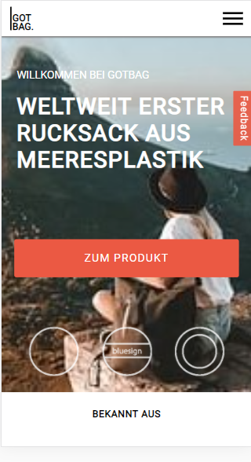
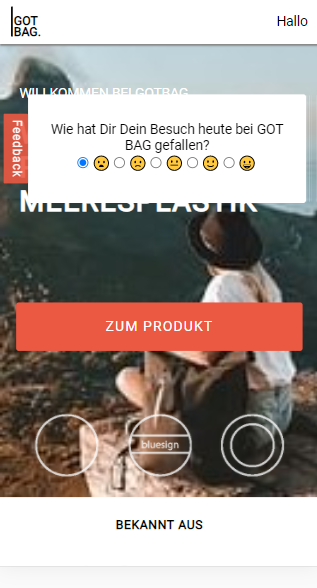
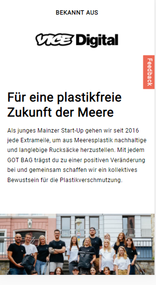
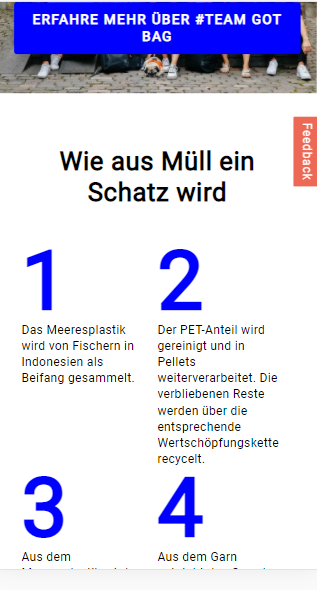
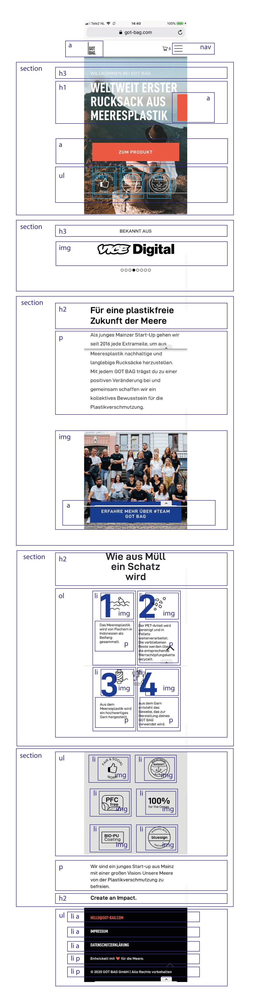
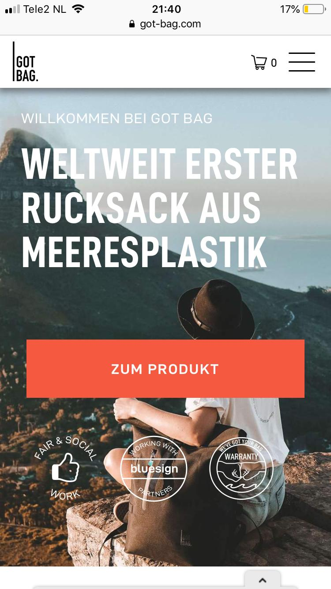
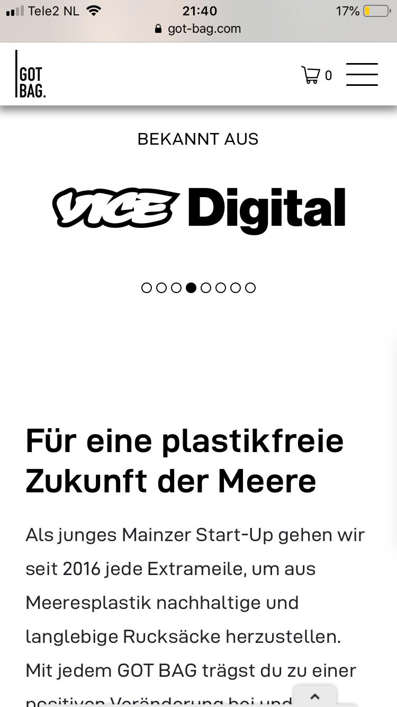
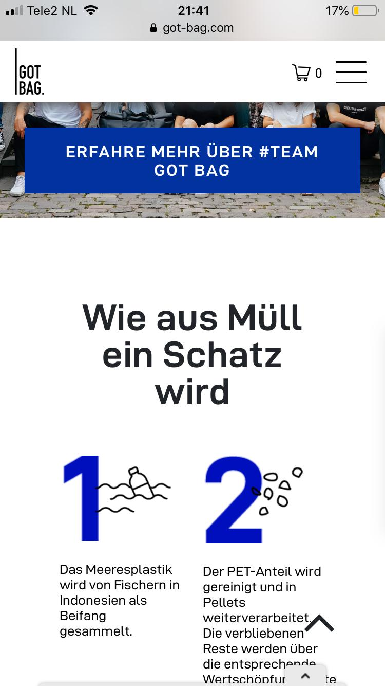
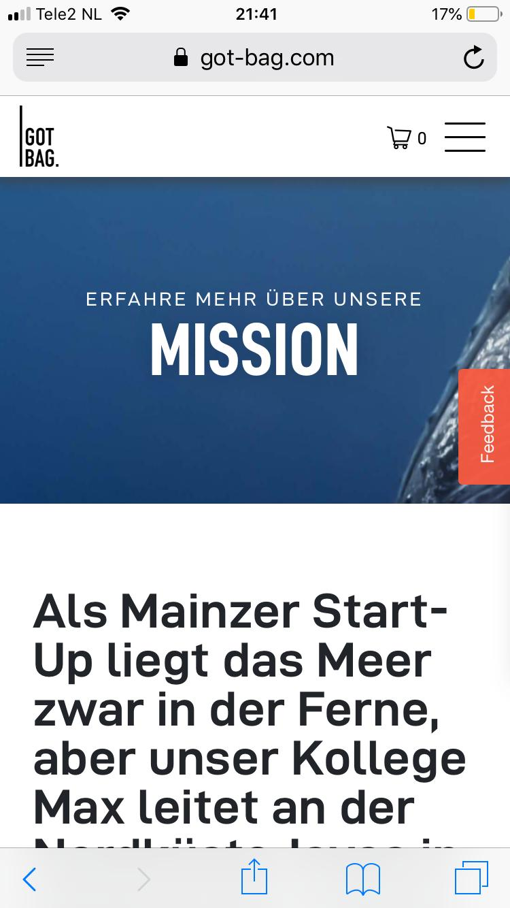
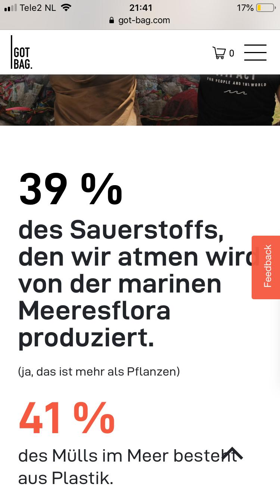

# Procesverslag
**Auteur:** Carolin Jaschek

Markdown cheat cheet: [Hulp bij het schrijven van Markdown](https://github.com/adam-p/markdown-here/wiki/Markdown-Cheatsheet). Nb. de standaardstructuur en de spartaanse opmaak zijn helemaal prima. Het gaat om de inhoud van je procesverslag. Besteedt de tijd voor pracht en praal aan je website.

## Bronnenlijst
1. Sanne ´t Hooft: JS 3-stap oefening 2 "Humpty"
2. -bron 2-
3. -...-

## Eindgesprek (week 7/8)

-dit ging goed & dit was lastig-

**Screenshot(s):**

-screenshot(s) van je eindresultaat-

## Voortgang 3 (week 6)

-same as voortgang 1-

## Voortgang 2 (week 5)

-same as voortgang 1-

## Voortgang 1 (week 3)

### Stand van zaken
-Het feedback formulier was lastig maar het is gelukt! Ik heb eerste ideeen over hoe ik het hamburger menu ga maken. Bij sommige elementen is de positionering nog niet helemaal goed op de verschillende mobiele devices. Ik mis nog de footer en een aantal andere elementen in de site.-

**Screenshot(s):**
-Ik heb mijn breakdownschets omgezet naar de HTML structuur en eerste stappen gemaakt met CSS om de basics van de pagina te maken. De feedback button is al klikbaar (met JS) maar nog niet helemaal gestylt. Het hamburger menu werkt helaas nog niet.-

### Agenda voor meeting

-samen met je groepje opstellen-

| Caro           | AnneFleur          | Hind         | Enis             | Julia
| ---            | ---                | ---          | ---              | ---
| Positioneren   |                    |              | geen vragen      | Hamburger
| van elementen, |                    |              |                  | menu
| hamburger menu,| ...                | ...          | ...              |
| kruisje om     |
| feedback form  |
| te sluiten     |

### Verslag van meeting

-na afloop snel uitkomsten vastleggen-

## Breakdownschets (week 1)

## Intake (week 1)

**Je startniveau:** rood

**Je focus:** surface plane

**Je opdracht:** (https://got-bag.com/ "GotBag - Duurzame tassen uit Duitsland")

**Screenshot(s) van de eerste pagina (small screen):**

**Screenshot(s) van de tweede pagina (small screen):**

