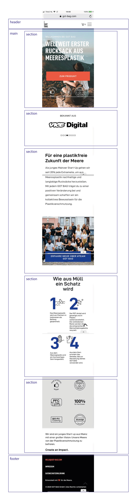

# Procesverslag
**Auteur:** Carolin Jaschek

Markdown cheat cheet: [Hulp bij het schrijven van Markdown](https://github.com/adam-p/markdown-here/wiki/Markdown-Cheatsheet). Nb. de standaardstructuur en de spartaanse opmaak zijn helemaal prima. Het gaat om de inhoud van je procesverslag. Besteedt de tijd voor pracht en praal aan je website.

## Bronnenlijst
1. Sanne ´t Hooft: JS 3-stap oefening 2 "Humpty"
2. Sanne ´t Hooft: Moving Hamburger
3. [CSS-only carousel](https://css-tricks.com/css-only-carousel/)

## Eindgesprek (week 7/8)

-dit ging goed & dit was lastig-

**Screenshot(s):**

-screenshot(s) van je eindresultaat-

## Voortgang 3 (week 6)

### Stand van zaken
- De homepagina is af. Zelfs het carousel is gelukt (ben er wel trots op!) Ik heb alleen nog twee vragen erover: hoe ik het beste de kleur van de bolletjes kan veranderen, als de gebruiker verder klikt en hoe ik het springen naar de bovenkant kan voorkomen. Deze week was ik dus bezig met het carousel en ik heb ervoor gezorgt dat mijn site toegankelijker wordt door meer states aan de buttons toe te voegen-

**Screenshots:**

### Agenda voor meeting

| Caro           | AnneFleur          | Hind         | Enis             | Julia
| ---            | ---                | ---          | ---              | ---
| bolletjes      |                    |              |                  |
| carousel en    |                    |              |                  |
| springen       |                    |              |                  |
| naar boven     |                    |              |                  |

### Verslag van meeting
-Komt later-

## Toegankelijkheid
- Ik heb de screenreader van windows gebruikt om mijn site te bereiken. Het ging op zich goed. De koppen en teksten werden voorgelezen, de buttons waren duidelijk en ook de ordered list. Ik weet gelukkig hoe mijn site eruit ziet maar ik denk dat het navigeren best moeilijk is als je helemaal niks ziet. Ik denk dat ik mijn alt-teksten nog beter kan maken. De navigatie werd helemaal niet voorgelezen, maar ik weet ook niet waar dat aan ligt. Leuk om deze ervaring een keertje te maken! Ik wist niet eens dat een screenreader op mijn laptop staat...-

## Voortgang 2 (week 5)

### Stand van zaken
-Ik heb de basis van de eerste pagina bijna helemaal af. Er zijn alleen nog maar wat kleinigheden nodig (en het carousel). Het hamburger menu en de feedback form werken en ik heb een animatie bij de emojis toegevoegd. Ik wil de aankomende week nog een carousel toevoegen bij "bekannt aus" en gaan experimenteren met de geleerde onderwerpen (animatie en grid). Het gaat goed en ik ben al benieuwd naar de tweede pagina.-

**Screenshots:**

### Agenda voor meeting

| Caro           | AnneFleur          | Hind         | Enis             | Julia
| ---            | ---                | Navigatie    | ---              | Navigatie
| position van   |                    |              |                  |
| de nav en      |                    |              |                  |
| uitklappen sub |                    |              |                  |
| menu, tips     |                    |              |                  |
| voor de        |                    |              |                  |
| carousel       |                    |              |                  |

### Verslag van meeting
-We waren maar met z´n drieen dus was er niet veel te bespreken. Ik heb de vragen gesteld, die ik had en ben ermee verder gekomen. Verder zag mijn code er netjes uit en moest ik alleen de groote van de screenshots in mijn procesverslag aanpassen. Het gaat goed en ik vind het steeds leuker om te gaan experimenteren met de mogelijkheden van CSS. Soms loop ik vast maar gelukkig is Marvin er dan!-

## Voortgang 1 (week 3)

### Stand van zaken
-Het feedback formulier was lastig maar het is gelukt! Ik heb eerste ideeen over hoe ik het hamburger menu ga maken. Bij sommige elementen is de positionering nog niet helemaal goed op de verschillende mobiele devices. Ik mis nog de footer en een aantal andere elementen in de site.-

**Screenshot(s):**
-Ik heb mijn breakdownschets omgezet naar de HTML structuur en eerste stappen gemaakt met CSS om de basics van de pagina te maken. De feedback button is al klikbaar (met JS) maar nog niet helemaal gestylt. Het hamburger menu werkt helaas nog niet.-

### Agenda voor meeting

| Caro           | AnneFleur          | Hind         | Enis             | Julia
| ---            | ---                | ---          | ---              | ---
| Positioneren   | Hamburger menu     | Hamburger,   | geen vragen      | Hamburger
| van elementen, |                    | positioneren |                  | menu
| hamburger menu,|                    |              |                  |
| kruisje om     |
| feedback form  |
| te sluiten     |

### Verslag van meeting

-We hebben samen een hamburger menu gemaakt. Dat was erg behulpzaam en interessant. Ik ben zeker dat het mij lukt. Daarnaast hebben wij het probleem opgelost dat de feedback button uit beeld gaat. -

## Breakdownschets (week 1)

## Intake (week 1)

**Je startniveau:** rood

**Je focus:** surface plane

**Je opdracht:** (https://got-bag.com/ "GotBag - Duurzame tassen uit Duitsland")

**Screenshot(s) van de eerste pagina (small screen):**

**Screenshot(s) van de tweede pagina (small screen):**

